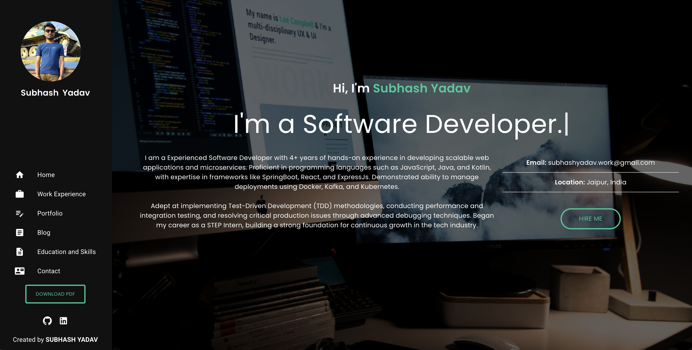

# 🌐 Subhash Yadav – Full Stack Developer

Welcome to my portfolio! I'm **Subhash Yadav**, a passionate **Full Stack Developer**. I am a Experienced Software Developer with 4+ years of hands-on experience in developing scalable web applications and microservices. Proficient in programming languages such as JavaScript, Java, and Kotlin, with expertise in frameworks like SpringBoot, React, and ExpressJs. Demonstrated ability to manage deployments using Docker, Kafka, and Kubernetes..

---

## 🔧 Skills & Technologies

- **Programming Languages:** JavaScript, TypeScript, Java, HTML5, CSS, Shell-Script, PostgreSQL
- **Frameworks:** Spring Boot, ExpressJs, React
- **Technologies:** Docker, Kafka, Git, Github Action

---

## 💼 Portfolio Highlights

---

## 📄 Preview

---

## 📞 Contact Me

- 📍 **Location:** Jaipur, Rajasthan, India
- ✉️ **Email:** subhashyadav.work@gmail.com
- 🌐 **Website:** [subhashyadav.com](https://subhashydv.github.io/subhashydv)
- 🧑‍💻 **LinkedIn:** [linkedin.com/in/subhashydv](https://ca.linkedin.com/in/subhashydv)

[//]: # (- 🐦 **Twitter/X:** @itsmesubhash404)

---

*Updated: June 2025*
